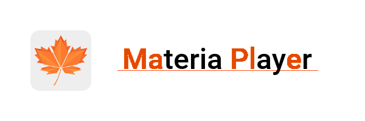
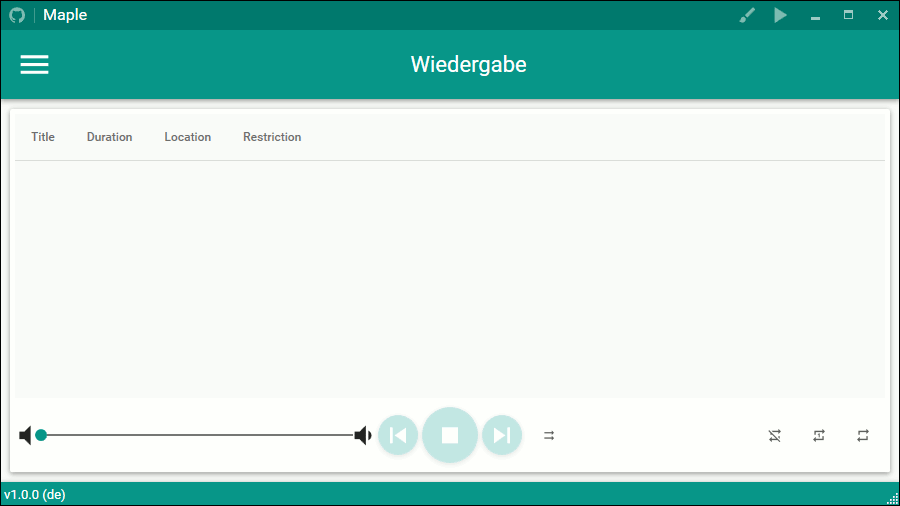

This is a rewrite of the original InsireBot. Which was planned to be a tool for semi and non professional livestreamers to provide music to them selfs and to their audience with high configureability.

After a long hiatus, I'm continuing my rewrite and try to improve on my previously written code. You can see a "live" preview [here](https://github.com/Insire/Maple/blob/master/InsireBot/Resources/Images/2017-04-22-23-26-20.gif). I also often refer to this project when explaining concepts to colleagues at work or during discussions in the [C# Discord Server](https://discord.gg/VCFhEDy).

## Compile Requirements:
 - Visual Studio 2017 Community Edition or better
 - .NET Framework 4.6.2, C# 7
 - Windows 10 (lower versions may run down till Windows 7)

## Features
- AudioPlayback
- AudioDeviceSelection
- PlaylistManagement for local audio files and audio from youtube
- Colorprofile Configuration, can be changed during runtime
- Localization (German, English ...), can be changed during runtime

## Dependencies
- [MaterialDesignInXamlToolkit](https://github.com/ButchersBoy/MaterialDesignInXamlToolkit) - UI Library
- [MahApps.Metro](https://github.com/MahApps/MahApps.Metro) - UI Library
- [MahApps.Metro.IconPacks](https://github.com/MahApps/MahApps.Metro.IconPacks) - UI Library
- [log4net](https://github.com/apache/log4net) - logging framework
- [AutoMapper](https://github.com/AutoMapper/AutoMapper) - convention-based object-object mapper
- [YoutubeExtractor](https://github.com/flagbug/YoutubeExtractor) - retrieval of video links from youtube
- [Google Api v3](https://github.com/google/google-api-dotnet-client) - Google APIs Client Library
- [NAudio](https://github.com/naudio/NAudio) - Audio and MIDI library
- [System.Data.SQLite](https://system.data.sqlite.org/index.html/doc/trunk/www/index.wiki) - ADO.NET provider for sqlite
- [EntityFramework](https://github.com/aspnet/EntityFramework6) - ORM mapper
- [Newtonsoft.Json](https://github.com/JamesNK/Newtonsoft.Json) - JSON framework 
- [DryIoc](https://bitbucket.org/dadhi/dryioc) - IoC container
- [Fluent Validation](https://github.com/JeremySkinner/FluentValidation) - Validation

## Useful Patterns, Concepts you may find here aswell
- Repository pattern
- MVVM pattern
- Dependency Injection
- Inversion of Control
- Composition Root
- various base implementations for INotifyPropertyChanged
- various implementations of ICommand (inspired by MVVMLight)
- how to setup MaterialDesignInXamlToolkit with MahApps.Metro
- how to change the Colorprofile for MaterialDesignInXamlToolkit and MahApps.Metro during runtime
- how to change your TaskbarIcon during runtime in a WPF app
- how to change the Localization of a WPF app during runtime
- how to save and load WPF WindowLocations
- how to use Googles Youtube API
- async Dialogs
- WPF Dialogs for File- and Folderbrowsing
- Unit Tests (very work in progress)

## MIT License
Copyright (c) 2017 

Permission is hereby granted, free of charge, to any person obtaining a copy
of this software and associated documentation files (the "Software"), to deal
in the Software without restriction, including without limitation the rights
to use, copy, modify, merge, publish, distribute, sublicense, and/or sell
copies of the Software, and to permit persons to whom the Software is
furnished to do so, subject to the following conditions:

The above copyright notice and this permission notice shall be included in all
copies or substantial portions of the Software.

THE SOFTWARE IS PROVIDED "AS IS", WITHOUT WARRANTY OF ANY KIND, EXPRESS OR
IMPLIED, INCLUDING BUT NOT LIMITED TO THE WARRANTIES OF MERCHANTABILITY,
FITNESS FOR A PARTICULAR PURPOSE AND NONINFRINGEMENT. IN NO EVENT SHALL THE
AUTHORS OR COPYRIGHT HOLDERS BE LIABLE FOR ANY CLAIM, DAMAGES OR OTHER
LIABILITY, WHETHER IN AN ACTION OF CONTRACT, TORT OR OTHERWISE, ARISING FROM,
OUT OF OR IN CONNECTION WITH THE SOFTWARE OR THE USE OR OTHER DEALINGS IN THE
SOFTWARE.

## Credits
- Application Icon - by vngnc aka [Keno Böhme](http://www.kenoboeh.me/)
- General Feedback - [C# Discord Server](https://discord.gg/VCFhEDy)
